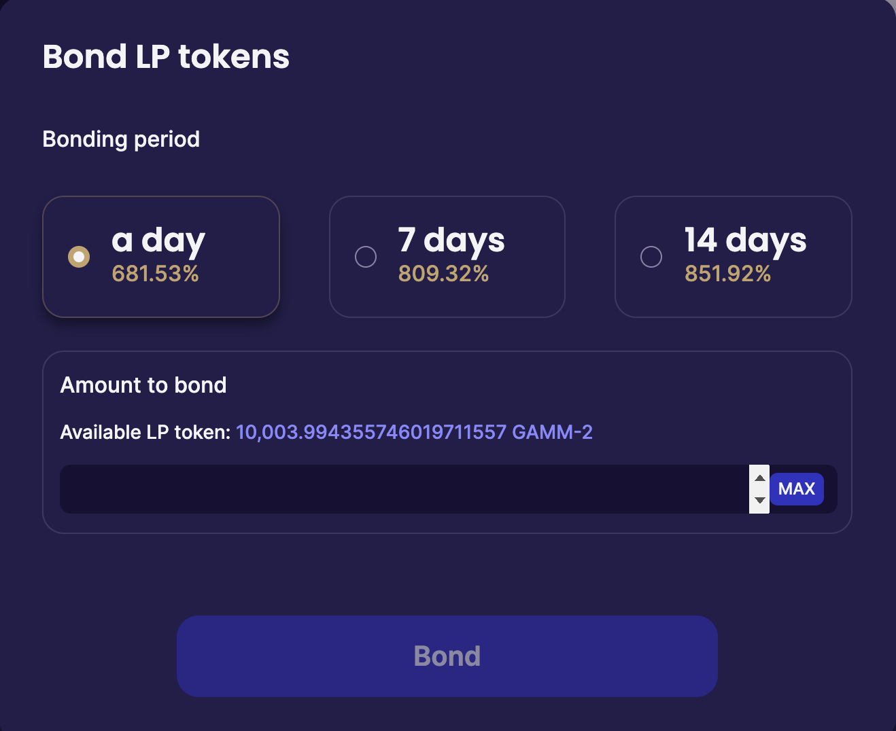

# Liquidity Bonding via CLI

If you'd like to bond LP shares via the CLI, please follow this guide.  It was first explain how to install the osmosisd node software (which includes the CLI), import your key, and then explains how to create CLI message to bond LP shares.  If you have already done some of these steps, please skip to section relevant to you.


## Install osmosisd


These instructions are written targeting an Ubuntu 20.04 system.  Relevant changes to commands should be made depending on the OS/architecture you are running on.

### Install Go

Osmosis is built using Go and requires Go version 1.15+. In this example, we will be installing Go on the above Ubuntu 20.04:

```sh
# First remove any existing old Go installation
sudo rm -rf /usr/local/go

# Install the latest version of Go using this helpful script 
curl https://raw.githubusercontent.com/canha/golang-tools-install-script/master/goinstall.sh | bash

# Update environment variables to include go
cat <<'EOF' >>$HOME/.profile
export GOROOT=/usr/local/go
export GOPATH=$HOME/go
export PATH=$PATH:/usr/local/go/bin:$HOME/go/bin
EOF
source $HOME/.profile
```

To verify that Go is installed:

```sh
go version
# Should return go version go1.16.4 linux/amd64
```

### Get Osmosis Source Code

Use git to retrieve Osmosis source code from the [official repo](https://github.com/osmosis-labs/osmosis), and checkout the `gentx-launch` tag, which contains the latest stable release.

```sh
git clone https://github.com/osmosis-labs/osmosis
cd osmosis
git checkout gentx-launch
```

## Install osmosisd

You can now build Osmosis node software. Running the following command will install the executable osmosisd (Osmosis node daemon) to your GOPATH.

```sh
make install
```

### Save your Chain ID in osmosisd config

We recommend saving the mainnet `chain-id` into your `osmosisd`'s client.toml.  This will make it so you do not have to manually pass in the chain-id flag for every CLI command.

```sh
osmosisd config chain-id osmosis-1
```

## Import your keys to the CLI wallet

The create a bonding tx, you will need to import your key to the CLI.

You can import such a key into `osmosisd` via a mnemonic or by using a Ledger device.

### Option 1: Import Via Mnemonic

To import via mnemonic, you can do so using the following command and then input your mnemonic when prompted.

```sh
osmosisd keys add <key_name> --recover
```

### Option 2: Import via Ledger

To import a key stored on a ledger, the process will be exactly the same as adding a ledger key to the CLI normally.
You can connect a Ledger device with the Cosmos app open and then run:

```sh
osmosisd keys add <key_name> --ledger
```

and follow any prompts.


## Create Bonding TX

To create a bonding tx, the first step is to determine which LP share to bond and what amount.

The LP share for each pool takes the form:  `gamm/pool/{poolid}`.

You can see your total bondable amount on the website in the "start earning" window.



When using the CLI, you must remove the comma  **and decimal point**.

Token amounts in the CLI are inputted by concatenating amount and then the token name.

So using the example in the image, if you wanted to bond that entire liquidity amount, the token amount would be:
`10003994355746019711557gamm/pool/2`

You also need to choose the duration of the lock. We suggest adding an extra few seconds to your lock, as this will help with the gas congestion issues.  So example durations are:

1 day: `86405s`
7 day: `604807s`
14 day: `1209609s`


Putting it all together now, you can bond your LP shares using the following command and inputting token amount and duration where relevant.

`osmosisd tx lockup lock-tokens [token amount] --duration [durationlength] --from [address] --gas 3000000 --chain-id osmosis-1 --node=tcp://178.128.154.17:26657`

Example would be:

`osmosisd tx lockup lock-tokens 500000000000000000000gamm/pool/4 --duration 86417s --from osmo10q97szll5adkm4lzzfqvnwaxmku0qmcfv96u2z --gas 3000000 --chain-id osmosis-1 --node=tcp://178.128.154.17:26657`

Please note that you may need to raise the gas limits depending on the network conditions, until a software upgrade reducing the gas for bonding LP shares is deployed on mainnet.
